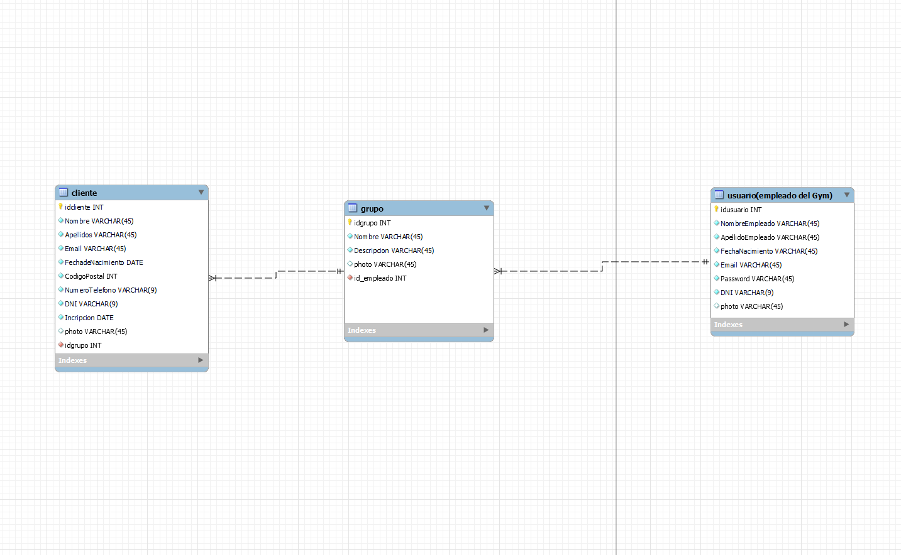
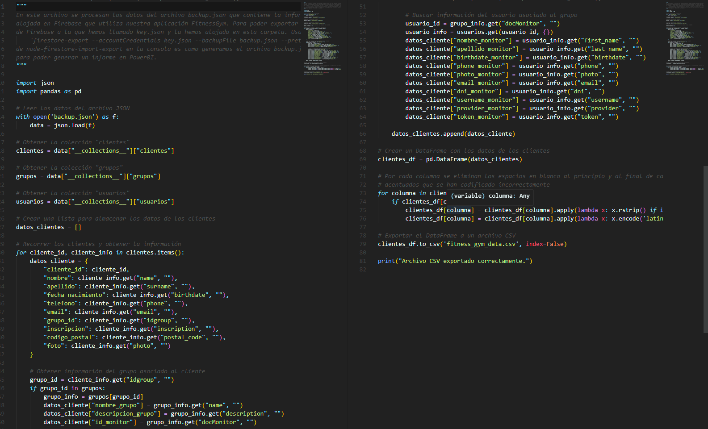
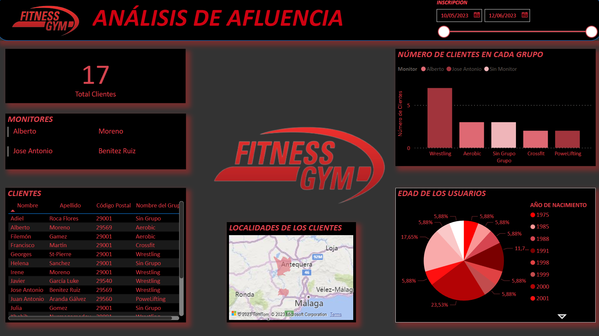

<h1 align="center">PROYECTO: FitnessGym</h1>

  

## Objetivo del Proyecto
Crear una aplicación tanto en nativo como en híbrido que gestione los clientes de un gimnasio, los grupos a los que pertenecen y la duración de su inscripción. La aplicación está orientada a la administración del gimnasio.

## Base de datos
La base de datos será en Firebase y se usará en ambas aplicaciones. Un empleado puede estar en muchos grupos, pero un grupo solo puede tener un empleado. Un grupo puede tener muchos clientes y un cliente puede estar en un grupo.

La aplicación consta de 3 modelos. El modelo "clientes" , de estos se necesita su nombre, apellidos, email, fecha de nacimiento, código postal, número de teléfono, DNI/NIE, una foto de perfil y el dia de la inscripcion.

Luego tenemos la entidad "grupos", que refiere a las clases y actividades que se imparten en el gimnasio. Necesitan nombre, descripción y foto. Un cliente puede estar en un grupo y un grupo tener muchos clientes.

Al cargo de cada grupo está un monitor, que es un empleado del gimnasio (empleado_gym). De estos se necesita su nombre, apellidos, fecha de nacimiento, email, contraseña, número de teléfono, DNI/NIE y foto de perfil. Un empleado puede tener muchos grupos a su cargo, pero un grupo solo puede tener un empleado al frente.

### Modelado de la base de datos (puede cambiar) - 13/04/2023

  

## Requisitos Específicos del Módulo Sistemas de Gestión Empresarial (SGE)
Para esta asignatura, procederemos a descargar los datos de los clientes (CSV o JSON), manipularlos con Pandas y crear un nuevo archivo que le sirva de entrada a PowerBI.

Para descargar los datos de los clientes hemos usado el paquete de node: node-firestore-import-export, para instalarlo hemos usado el comando npm i -g nombredelpaquete o npm install -g nombredelpaquete. Una vez fue instalado usamos el comando : firestore-export --accountCredentials path/to/credentials/file.json --backupFile /backups/myDatabase.json remplazando las rutas por las nuestras propias rutas, para obtener las credenciales tuvimos que generar una nueva key en firebase.

Una vez teniendo el backup desarollamos usando la libreria de pandas el siguiente archivo:

  

## Requisitos Específicos del Módulo Desarrollo de Interfaces (DI)
Para la asignatura de diseño de interfaces, crearemos un informe a partir de esos datos (Los datos de los clientes y los grupos a los que pertencen) en el que hemos mostrado gráficas como rangos de edad, grupos con mas clientes, monitores que están a cargo de más/menos grupos, el total de los clietnes, una tabla para visualizar todos los datos de los clientes y un mapa con la localidad de estos clientes. Se subirá al repositorio del proyecto y también se publicará en Power BI, compartiéndolo con la dirección de correo educativa del profesor.

  

## Trello
Este proyecto utiliza Trello para la gestión de las tareas a realizar.
[Trello FitnessGym](https://trello.com/b/bwXyty7u/fitnessgym)

## Anteproyecto
[Anteproyecto Fitness Gym](https://www.figma.com/file/kvU6qBh4NmjaGoooBiBPvJ/Anteproyecto-Fitness-Gym?node-id=0%3A1&t=e7FTqe0I8Yq6Mbhf-1)

## Vídeo Checkout 05/05/2023
[Ver vídeo en YouTube](https://www.youtube.com/watch?v=go-7G-VvBFE)

## Vídeo Final 16/06/2023
[Ver vídeo en YouTube](https://www.youtube.com/watch?v=go-7G-VvBFE)
## Desarrollado por:
- Jose Antonio Benitez (Híbrido)
- Alberto Moreno (Nativo)
